# SPECTRAL TUTORIAL

###### Or how I stopped worrying and learned to love templates


---


This guide will show you how to use an HTML5 UP template to create a website, the HTML 5 symbol will be used when we are writing code.


You will also learn how to save your project and all the changes you make to GitHub. The Octocat symbol will be used when we are interacting with our repository.


## Things to set up

1. Get your favorite text editor out.
   - We recommend **Visual Studio Code** or **Sublime Text**
2. Open a web browser
   - We recommend **Google Chrome**


### Things to remember

- Refresh you browser often to check what your website looks like

- Save regularly

  

#### Get comfy. Lets begin

---

## 1. Create a new repository


Open **GitHub desktop** and Sign in (create an account if you haven’t got one already).

Choose **Create a New Repository on your hard drive**

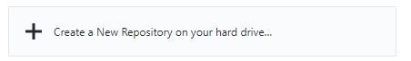

Set the name to be "**Spectral-Alpacas**" and the description to "**HTML5 Alpaca website**"

Choose a suitable location on your hard drive and click **Create repository**.

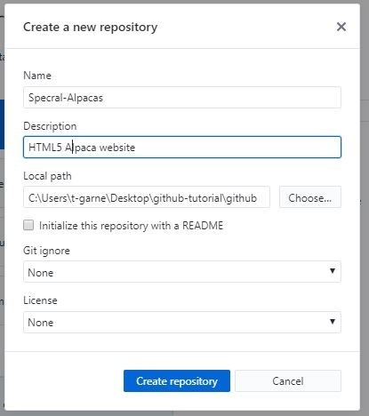

#### You have Just Created a new local repository!


---

## 2. Open the repository folder


At the bottom right of the screen Click **Show in Finder** (**show in Explorer** on a PC), this will take you to where the repository is stored on your computer. 

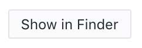

You should see a folder called **Spectral-Alpacas,** this is where you will put your all the code and assets for this worksheet.


---

##  3. Download the Spectral template from HTML5 UP

Go to https://html5up.net/

Scroll down to Spectral and click “**Free Download**” 

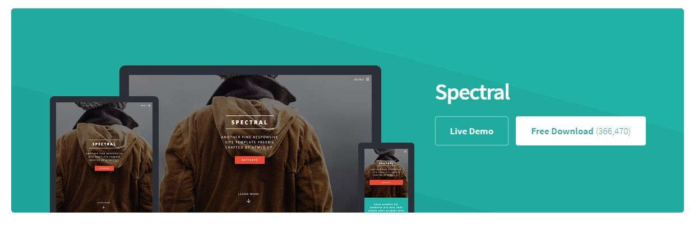

*You can use another template for your coursework, but for this worksheet we will be using Spectral*

**Unzip or Extract** this zip file, and put the contents **inside** the **Spectral-Alpacas** folder you found in step 2. 

You should now have a folder called **Spectral-Alpacas** which contains the following files:

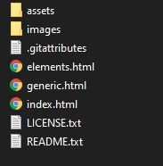


---

## 4. Commit the code to your local repository
On **GitHub desktop** you should now see a list of all the files you have added.

On the left you will see the files.

On the right you will see what has changed in each of those files.


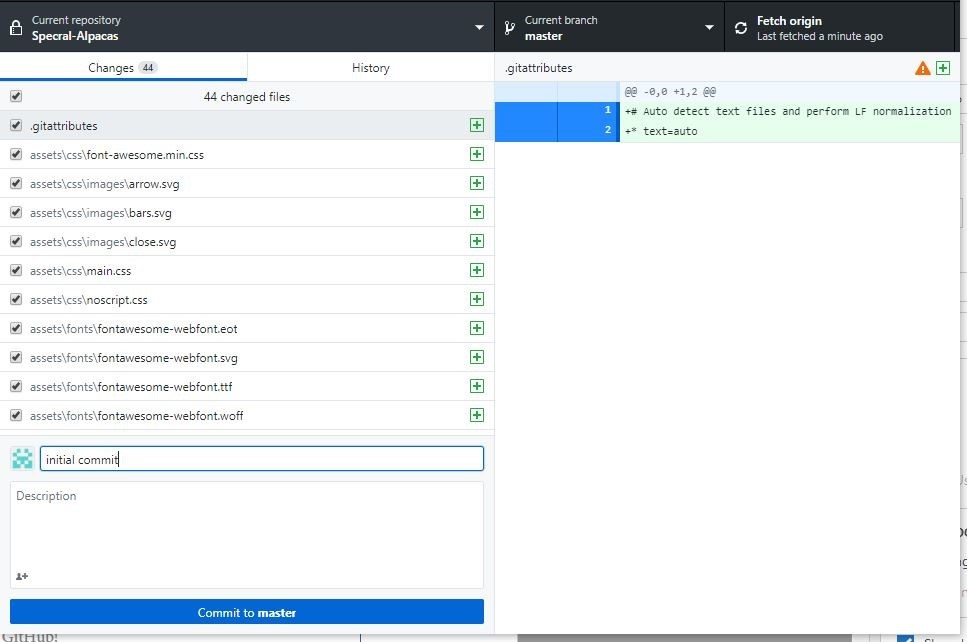


Write "**initial commit**" in the summary field and press **Commit to master.**


#### You have now committed your code to your **local repository**!


---

## 5. Publish your repository
Press **Publish Repository**


This will upload your files to your account on GitHub.com

#### You have now published your code to your remote repository on GitHub!


---

## 6. View your repository on GitHub
Click on **View on GitHub**

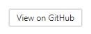

This will open a browser window and show you your repository on Github.com

Now that it is on the remote repository your work is safe, even if you lose your computer you can just clone a new copy of your work from this repository.

You can also share your code with others and see exactly what changes have been made.

Throughout the rest of this worksheet we will be making changes to our files on our machines, committing those changes to the **local repository** and then pushing to the **remote repository**. This way we make sure our remote repository is kept up to date.


---


## 7. Edit the title
Phew, now that we have setup GitHub we can now start editing the code.

Open **index.html** on your web browser.


Open **index.html** on your text editor

In the index.html file, you will see the `<title></title>` tag. This changes the text in the tab title of your website.

Change the tile from:

`<title>Spectral by HTML5 UP</title> `

to:

**`<title>ALPACAS FOREVAH</title> `**

**Save**

**Refresh your browser to see the change** 

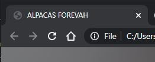


---

## 8. Commit changes
Now look at GitHub desktop, it will show you what you have changed.

This is only a small change but we will add it to our repository

Change the summary message from:

`Update index.html!`

to:

**`Updated title`**

Press Commit to Master to add this change to your local repository

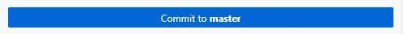

We will wait to push to the remote repository until we have a few more changes.


---

## 9. Change the main heading
The main heading of a page is in the heading tag

`<header id="header" class="alt"> `

In this case it is hidden until the user scrolls the page.

In index.html, change the heading text from:

`<h1><a href="index.html">Spectral</a></h1>`

to:

`<h1><a href="index.html">Lamas Are Cool</a></h1> `

Save

Refresh your browser and find what has changed (HINT: you may need to scroll)


---

## 10. Commit changes on GitHub desktop
Change the summary message from:

`Update index.html!`

to:

`Changed H1 contents`

Commit this change to your local repository as you did before


---

## 11. Change the menu
We are going to make a few text changes to the main menu.

`<div id="menu">`

Look at the menu in your browser before you make the changes.

Then find it in the code and see how it is structured. 

`<li >` is a list item.

`<a href=` is a link tag. This template has two separate pages, which we will look at soon.

`#` is a local link, it doesn't go anywhere

First let’s remove some of the  items. and change the text on others.  

Right now we will link them to the generic page template. 

change:

```html
<div id="menu">
	<ul>
		<li><a href="index.html">Home</a></li>
		<li><a href="generic.html">Generic</a></li> 
	 	<li><a href="generic.html">Generic</a></li> 
	 	<li><a href="generic.html">Generic</a></li> 
	 	<li><a href="elements.html">Elements</a></li> 
	 	<li><a href="#">Sign Up</a></li> 
	 	<li><a href="#">Log In</a></li>
	</ul> 
</div>
```
to:

```html
<div id="menu"> 
	<ul> 
		<li><a href="index.html">Home</a></li> 
		<li><a href="generic.html">History</a></li> 
		<li><a href="generic.html">Fleece</a></li> 
		<li><a href="generic.html">Contact</a></li> 
	</ul>
</div> 
```

Save

Refresh the browser to see your changes


Commit this change to your local repository as you did before, adding a suitable summary message


---

## 12. Change the banner

Have a look at how this section works. We are going to personalise this a bit and make it more on concept.

We currently have:

```
<section id="banner"> 
	<div class="inner"> 
		<h2>Spectral</h2>
		<p>Another fine responsive<br /> site template freebie<br /> crafted by <a href="http://html5up.net">HTML5 UP</a>.</p> 
		<ul class="actions special">
			<li><a href="#" class="button primary">HTML5UP</a></li>
		</ul>
	</div> 
 	<a href="#one" class="more scrolly">Learn More</a> 
</section> 
```


Change the header from:

`<h2>Spectral</h2>`

to:

**`<h2>ALPACAS RULE</h2>`**

Then change the paragraph text from:

`<p>Another fine responsive<br /> site template freebie<br /> crafted by <a href="http://html5up.net">HTML5 UP</a>.</p> `

to:

**`<p>This is a template<br />that is all about Alpacas<br /> made by<a href="put your wordpress url here">Your name here</a>.<br />And with thanks to</p> `**

Try taking out the `<br/>` tags, or moving them around, what changes?

Then lastly, change the link from:

`<li><a href="#" class="button primary">HTML5UP</a></li>`

to

**`<a href="https://html5up.net/" class="button primary">HTML5UP</a>`**

Save and refresh


Commit this change to your local repository as you did before


---

## 13. Publish

You have now made a few commits to your **local repository**. 

However, this means that your **remote repository** is now out of sync.

Go to GitHub desktop and press **Push origin**


Your **local** changes have now been sent to the **remote repository** where they are safely stored 

To see the files on github.com click "**view on Github**"


---

## 14. Edit section One

In HTML you can write a comment by using the angle brackets with an exclamation mark.

`<!-- this is a comment -->`

find the comment in index.html that shows you where section one starts

`<!-- one-->`

First change the `<h2>` title to:

**`<h2>With Alpacas, you have a friend indeed. <br />Here are some fun facts about our South American Camelid friends</h2> `**

Next change the  paragraph `<p>` text to:

**`<p>From their water and flame resistant fleece to their ability to guard <br />chickens, alpacas are excellent, ancient, domesticated animals</p>`**

We will remove the icons in this section. 

comment them out:

**`<!-- <ul class="icons major">`** 

​	... 

**`</ul> -->`**  


Commit this change to your local repository as you did before


---

## 15. Revert a mistake

### We have made a mistake...

Looking back at the changes we have made, we realized that in section **9** we accidentally used the word Lamas!

As this is a small issue it would be easy to just change the text and then commit the changes BUT there is another way.

We can remove individual commits from our repository. This can be very useful if you have published a large change that you now want to undo.

On GitHub desktop, click on the history tab 

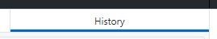

Scroll down and select the commit you made when you added "**Lamas are cool**".

It should be called **"Changed H1 contents"**

Right click and select **Revert this commit** 

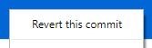

Go back to the Changes tab and press **Push origin**


If you refresh your browser, it should now display the old header


---

## 16. Changer the header (again)

Now go back to the header at the top and change the H1 tag again

Change:

`<h1><a href="index.html">Spectral</a></h1>`

to:

`<h1><a href="index.html">Alpacas Are Cool</a></h1>`


Commit this change to your local repository as you did before


---

 

## 17. Section Two

Section two is wrapped in a `<section>` tag with an id of "**two**"

`<section id="two" class="wrapper alt style2">`

...

`</section>`

Nested Inside this section tag you will find 3 other sections each with a class of "**spotlight**"

`<section class="spotlight">`

...

`</section>`

we want 5 spotlight section. To add more simply copy and paste the last section twice. make sure you copy the whole section including the closing tag `</section>`

You can now edit the content of all the spotlights.

Replace the `<h2>` heading text for each of the 5 sections with these lines, one per section:

**`<h2>Alpacas are ancient</h2>`** 

**`<h2>Alpacas grow high quality <br />hypoallergenic fleece</h2>`** 

**`<h2>Alpaca fleece is flame resistant</h2>`** 

**`<h2>Alpaca fleece comes in <br />a rainbow of hues</h2>`** 

**`<h2>Alpacas are excellent<br /> guards for chickens</h2>`** 

Next, replace the `<p>` paragraph text in the same way:

```
<p>Alpacas were domesticated by the Incas more than 6,000 years ago and raised for their exquisite fleece. Due to its quality and all of its superhero characteristics, alpaca fibre was reserved exclusively for the elite and nobility.</p>
```
```
<p>Alpaca fibre is much like sheep’s wool, but warmer and not itchy. It is lacking in lanolin, which makes it hypoallergenic and also allows it to be processed without the need for high temperatures or harsh chemicals in washing.</p>
```

```
<p>Alpaca fibre meets the standards of the U.S. Consumer Product Safety Commission's rigid testing specifications as a Class 1 fibre for use in clothing and furnishings.</p>
```

```
<p>Alpaca fiber comes in 22 colors and hundreds of shades, from white to light rose gray to dark fawn, in addition to the blends that can be made from those, thus minimizing the need for pollution-intensive dying.</p>
```

```
<p>Alpacas have been used as chicken and sheep guards for over 17 years in Australia. They quickly become very protective of their flocks and will chase foxes and other predators away if they try to approach.</p>
```

Save

Refresh you browser to see what you have.

if it looks strange, go back and make sure you have the correct opening and closing tags for each section


Commit this change to your local repository as you did before


---

## 18. Images

We now want to replace the image for each of the spotlight sections

``

Look in your images folder, you will find the 3 images that are currently being used for this section

pic01.jpg 

pic02.jpg 

pic03.jpg 

We want to replace these ugly placeholder images with our own.

First, check the size of the images, in windows you can do this by **right clicking** on them, select **properties** and then selecting **general**. On a mac you can just select the image in the finder.

Alternatively, you can open the image in photoshop and choose **image>image size**.

Now that you know the size, you can make sure any replacement images are the same size.


On blackboard there are five zipped up alpaca images that are the right size (**spotlight_images.zip**).  download and unzip this file.

Place the alpaca images in the same folder as the original images

On each of the spotlight sections you now need to change the image name

replace

``

with

``

Do this for each of the spotlight sections.

Save,

Refresh your browser


Commit this change


Push to origin

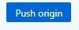


---

## 19. Remove un-wanted section

We don't want everything in this template, therefore we are going to remove the next section.

delete or comment out all of section 3.

from

`<!-- Three -->`

to 

`<!-- CTA -->`


save and refresh and check it has worked on the browser


Commit this change


---

## 20. Call to Action (CTA)

**This is an area where you can use a button or buttons to make links to motivate.** 

Replace the content of the`<h2>` and`<p>` tags with:

```
<h2>Give the Gift of an Alpaca to help end hunger</h2>
```

and

```
<p>By buying alpaca gift donations for charity, you can provide a struggling family with a lifetime of opportunities. Your donation will provide an alpaca to a family in need, along with training and education in its care.</p>
```

Change the text on the **activate** button to **Donate** 

Change the **learn More** button to **Heifer Project** 

Next, add the correct link address to each button

change:

`<li><a href="" class="button fit primary">Donate</a></li>`

to

**`<li><a href="https://www.heifer.org/campaign/end-hunger-poverty-donation.html" class="button fit primary">Donate</a></li>`**

and change:

`<li><a href="" class="button fit">Heifer Project</a></li>`

to:

**`<li><a href="https://www.heifer.org/gift-catalog/animals-nutrition/gift-of-an-alpaca-donation.html" class="button fit">Heifer Project</a></li>`**


Commit this change


---

## 21. Elements

In the same folder as index.html you will find two other html files.

elements.html contains lots of useful elements such as forms, buttons and tables you may want to use in your own project. Most HTML5 UP templates have an elements page included.

Open elements.html in your web browser and look at the buttons half way down the page

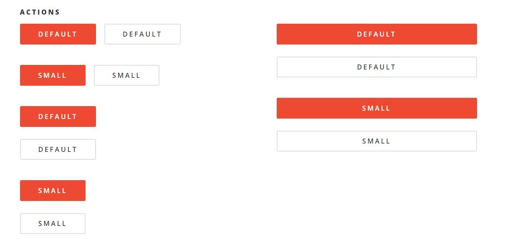

Next open elements.html in your code editor and find the html code for one of the buttons (you choose which one)

Copy the code into your index.html file bellow the Heifer Project button you created in the last step.

 


Commit this change


---

## 22. Banner

So right now we have been dealing with a gradient background as the top image and then again at the bottom. This is the .jpg called banner

This is a “responsive image”, and isn’t coded in the html like the previous images we replaced. It is located in the css. The nice thing about a template is that we don’t need to do the work to make this image responsive. As long as we play by the templates rules, the work is already done for us.

Open **main.css** in your code editor and search for  **banner.jpg**. You will see it show up in about 12 places. It is a background-image in the css and has a small amount of opacity on it ( rgba. a being alpha — or opacity). 

Find an image that is at least **1800x1280 @ 72dpi**. (but not too big!)

www.pexels.com has lots of free stock images. 

Rename this image as **banner.jpg** and place it in the images folder, overwriting the existing image.


Commit this change


Push to origin


---


## 23. A New page

So far we have been editing one page. We want to make another one.

First we need a link so we can get to the new page

Back in step **11** you changed the menu items. We will now change one to link to a new contact page

change

`<li><a href="generic.html">Contact</a></li> `

to:

`<li><a href="contact.html">Contact</a></li> `

We now want to create the new page. To do that copy the whole file.

Copy **generic.html** and rename it **contact.html**

Then open **contact.html** in your code editor

change the header from:

```
<header>
<h2>Generic Page</h2><p>Aliquam ut ex ut interdum donec amet imperdiet eleifend</p>
</header>
```

to:

```
<header>
<h2>Contact Us</h2><p>Please say hello and sign up to our newsletter</p>
</header>
```

Now test out your link. In your browser, click on the history link and see if it sends you to your  new history page.


Commit this change


Push to origin


---

---


## FINISHED!

Well, there you have it. We have a brand new website about alpacas, ready to go. For this tutorial, we mainly dealt with the html, focusing on some aspects that you might encounter when you work on your own html template.


You have also successfully used Git and GitHub to save your work to a local repository on your computer and pushed it to a remote repository on GitHub.

If you now need the code on another machine you can now get all you source code from GitHub.


## Extra Challenge

### 24. Finish off the contact page

We have added a contact page but have not added any content.

Find some form elements from elements.html and make a contact form on contact.html


 